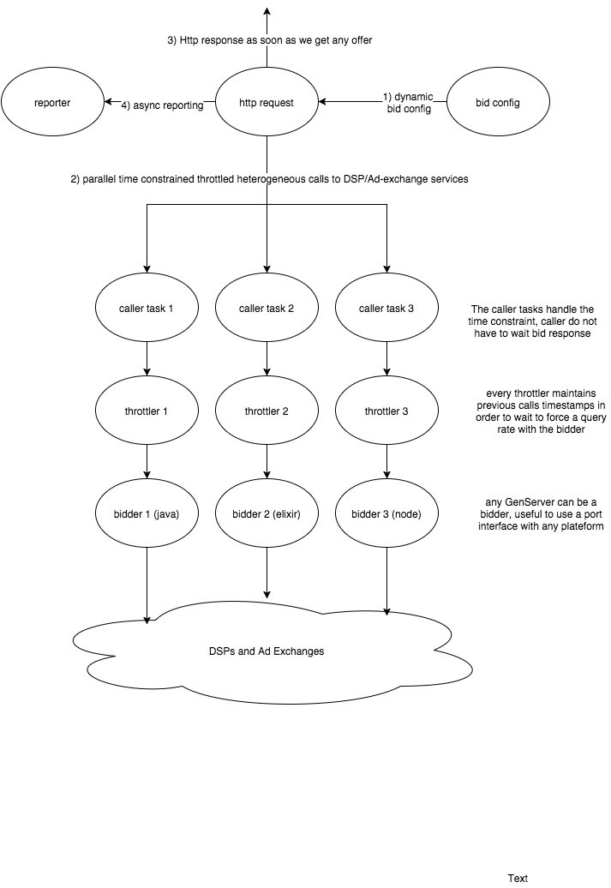
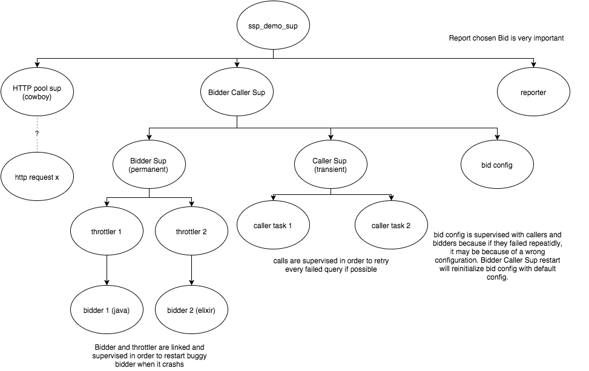
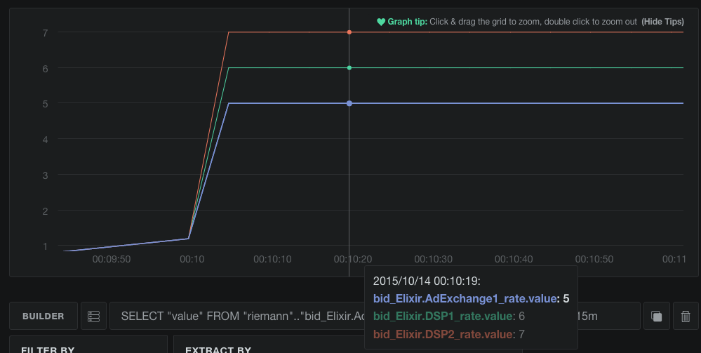
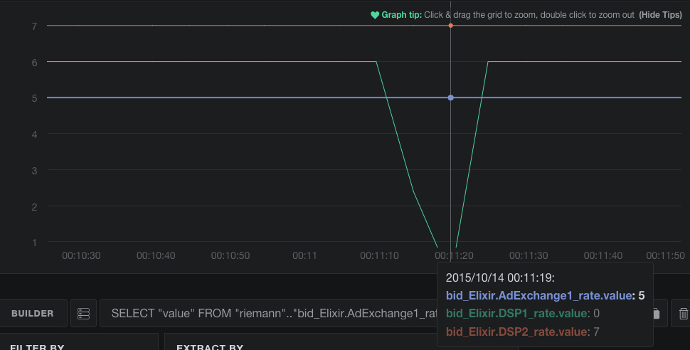
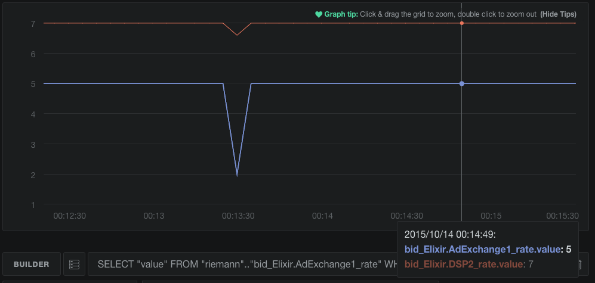
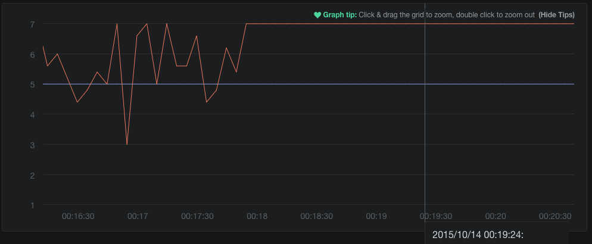

# SSPDemo

Context : website publishers want to dynamically start an auction for
an ad impression. SSP (Supply Side Plateform) are tools which allow
them to propose their Ad slot on multiple Exchange and query buyers,
through their DSP (demand Side Plateform) which propose some bid and
SSP should them show the Ad (sell the time and space slot) of the
highest bidder.

Here the demo use this context as an example because the contraints
are very nicely handled by Elixir :

- The bidder querying library can be a proprietary library in any language
- The calls to bidders have to be done in parallel
- The bidders are external services which can allow only a limited
  rate of bid requests.
- The AD answer should be limited in time with a timeout, if all the
  bidders did not answer before it, then the auction will not include
  slow bidders.
- We have to retry a failed bidder because if it is the highest
  bidder, then money can be lost if you do not retry on errors.
- Reporting should be done asynchronously after the HTTP answer. 
- The AD is money, and any non-filled AD slot on the website is a
  waste of money. So any unexpected bug or state of the system should
  be handled nicely without any AD print loss, and it would be nice
  if we could fix a bug without losing current slot auctions.

First lets draw our need :



Then organize states dependencies in a supervision tree,
all communicating processes (dependent states) should be supervise
together. For instance here, callers, bidders and config act together
to give a bid response, but independently from the http request and
from the reporting. Transient caller processes allows a query retry
strategy. 


Plug metrics into Riemann with config `./riemann.config`
which compute rates and send them to influxdb.
Use chronograph to show a graph querying influxdb rate timeseries.

http://127.0.0.1:10000/graph?d0=riemann&d1=riemann&d2=riemann&d3=riemann&d4=riemann&f0.0=value&f1.0=value&f2.0=value&f3.0=value&f4.0=value&m0=bid_Elixir.AdExchange1_rate&m1=bid_Elixir.DSP1_rate&m2=bid_Elixir.DSP2_rate&m3=auction_fail_rate&m4=auction_success_rate&s0=22&s1=22&s2=22&s3=22&s4=22&tl=now()%20-%2015m

- show diagram
- show code:
  - quick supervision tree
  - throttler
  - query management
  - the bidder protocol and default impl thanks to Elixir
  - erlastic power : include java / python / node / etc. libraries
  - elixir power: dynamic code generation from spec and mix task

- show precise query rate management and memory control with throttling
- show external port memory leak -> OM Killer -> recovery
- remove the Java open Bidder to simplify demo explanations
- show state related bug in AdExchange1 and config recovery with min_cpm: 10
- show random bug in DSP2 and resilience thanks to task transient supervision
- show hot reloading removing the bug

Firstly, when we load the server with many concurrent queries (`requester.sh`),
we observe that the back pressure mechanism do its job and bidder
query rate is exactly as configured in mix `confix.exs` (respectively 5, 6 and 7 query per second)
and that the java server behave exactly as Elixir ones.



Then we try to simulate a memory leak in the java library and that
the linux OM killer kill the java process with a `kill -9`.

- The java bidder is down for a while but thanks to the other bidder
no queries are lost. 
- The java process is restarted by the Elixir supervision tree and
  the bidder is back in the game.



Then we introduce an unhandled config in one bidder : 
[bidder.ex line 4](https://github.com/awetzel/ssp_demo/blob/master/lib/bidders.ex#L4)
This bidder does not handle the minimum bid value "10" and crash in this case.

Since the auction is dynamically configured, some user can update the
minimum bid value with 

```elixir
SSPDemo.Config.update min_cpm: 10
```

In the graph we see that automatically, the server crashes and
restarted as seen before. But since it crash repeatidly, the top
supervisor die also and restart the "dependant" state/processes. So
the "config" service is restarted in its initial state, losing the
unhandled config. But this puts the system in a new working state
without never killing any HTTP query or reports.



Finally we add a random unexpected crash with : 
[bidder.ex line 12](https://github.com/awetzel/ssp_demo/blob/master/lib/bidders.ex#L12-L13)
The rate became unstable but thanks to the caller restart strategy (retry), the
we continue to get all the bid only in a more uncertain and long time.
Then we correct the bug, recompile and hot reload the fix (`l DSP2` in the shell).
The graph shows that then the system became stable again without losing any queries.



Enjoy !
